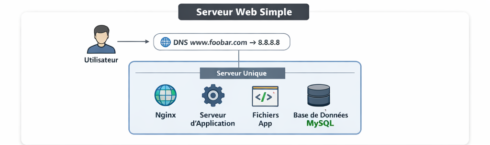

# **0 – Simple Web Stack**

## **Scenario**

A user wants to access the website `www.foobar.com`. The request goes through the internet, resolves the domain name to the server’s IP, reaches the server, and the web page is served.

---

## **Infrastructure Design**

**Components:**

1. **Domain Name:** `www.foobar.com`

   * Type of DNS record: **A record** pointing to **8.8.8.8** (server IP).
   * Role: Allows humans to use a readable name instead of remembering the IP address.

2. **Server:** Single physical or virtual machine hosting all components.

   * Role: Runs the web server, application server, and database. Provides services to clients.

3. **Web Server:** Nginx

   * Role: Receives HTTP requests from users and forwards them to the application server. Serves static files (HTML, CSS, JS).

4. **Application Server:** Hosts the backend code (your codebase).

   * Role: Processes business logic, interacts with the database, and generates dynamic content.

5. **Database:** MySQL

   * Role: Stores, retrieves, and manages structured data required by the application.

6. **Communication:**

   * The server communicates with the user’s computer using the **HTTP/HTTPS protocol over TCP/IP**.

---

## **How It Works**

1. User enters `www.foobar.com` in their browser.
2. Browser sends a **DNS query** to resolve `www.foobar.com` → **8.8.8.8**.
3. The request reaches the server at **8.8.8.8**.
4. **Nginx web server** handles the request.
5. If the request requires dynamic content, Nginx forwards it to the **application server**.
6. Application server interacts with **MySQL** to fetch or store data.
7. The response is sent back to the **web server**, then to the **user’s browser**.
8. The website is displayed.

---

## **Issues with This Infrastructure**

1. **Single Point of Failure (SPOF):**

   * If the server goes down, the website becomes unreachable.
   * No redundancy in web, application, or database layers.

2. **Downtime during maintenance:**

   * Restarting the web server or updating code will make the site temporarily unavailable.

3. **Scalability issues:**

   * A single server cannot handle high traffic efficiently.
   * Performance decreases as QPS (queries per second) increases.

---

### **Diagram (Example)**

