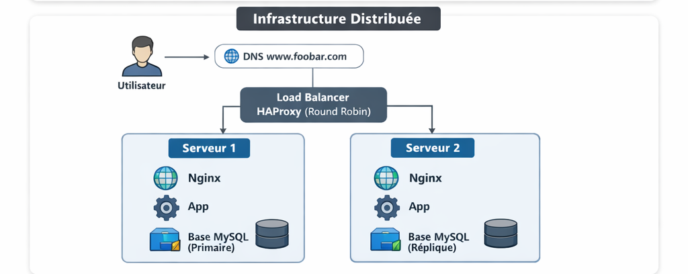

# **1 – Distributed Web Infrastructure**

## **Scenario**

A user wants to access `www.foobar.com`. To improve availability, performance, and redundancy, we now use **three servers** with a **load balancer**.

---

## **Infrastructure Design**

**Components:**

1. **Domain Name:** `www.foobar.com`

   * Type of DNS record: **A record** pointing to the **load balancer IP**.
   * Role: Directs user traffic to the load balancer instead of a single server.

2. **Load Balancer:** HAproxy

   * Role: Distributes incoming HTTP requests across multiple web servers.
   * Distribution algorithm: **Round Robin** (requests are sent one by one to each server in order).
   * Setup type: **Active-Active** – both servers can handle traffic simultaneously.

     * Difference:

       * **Active-Active:** all servers actively serve traffic.
       * **Active-Passive:** one server serves traffic while the other waits as a backup.

3. **Web/Application Servers (2 servers):**

   * Each server contains:

     * **Web server (Nginx):** Serves static content and forwards dynamic requests to the application server.
     * **Application server:** Processes business logic, handles requests, communicates with the database.
     * **Application files (codebase):** Stored locally or synced across servers.

4. **Database Cluster:** MySQL Primary-Replica

   * **Primary node:** Handles all **write operations** (INSERT, UPDATE, DELETE).
   * **Replica node:** Handles **read operations** to reduce load on the primary.
   * Changes from Primary are replicated to Replica(s) automatically.

5. **Communication:**

   * Users communicate via **HTTP/HTTPS over TCP/IP**.
   * Load balancer manages distribution to multiple servers.

---

## **How It Works**

1. User enters `www.foobar.com` → DNS resolves to **load balancer IP**.
2. **HAproxy** receives the request and forwards it to one of the two web/application servers using **Round Robin**.
3. The server’s **Nginx web server** handles static content or passes dynamic requests to the **application server**.
4. Application server reads/writes data to **MySQL Primary-Replica database**:

   * Writes go to **Primary**.
   * Reads can go to **Replica**.
5. Response is sent back through HAproxy to the **user’s browser**.

---

## **Why We Added These Elements**

* **Load balancer:** Eliminates single point of failure, distributes traffic, improves performance.
* **Second server:** Provides redundancy, improves fault tolerance, enables Active-Active setup.
* **Replica database:** Reduces load on the primary, increases read performance, ensures data backup.

---

## **Issues with This Infrastructure**

1. **Remaining SPOF:**

   * Load balancer itself is a single point of failure.
   * Database Primary node is a SPOF for write operations.

2. **Security issues:**

   * No firewall rules or access control defined.
   * Traffic is not secured (no HTTPS).

3. **No monitoring:**

   * No tools in place to track uptime, server performance, or failures.

---

### **Diagram (Example)**

