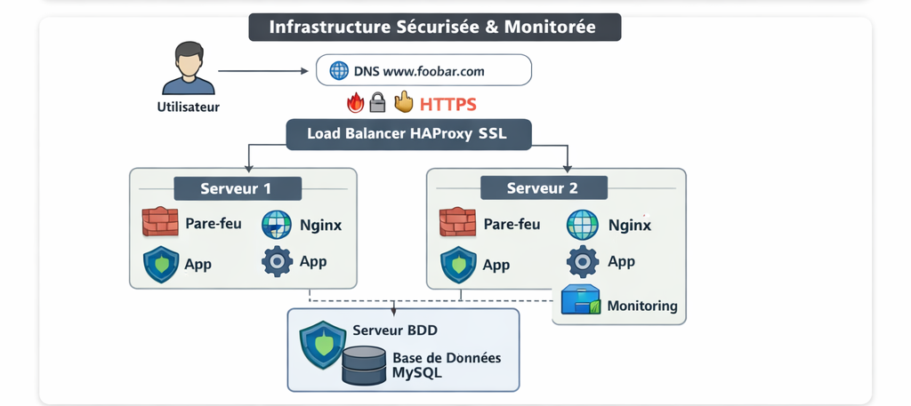

# **2 – Secured and Monitored Web Infrastructure**

## **Scenario**

A user wants to access `www.foobar.com`. This infrastructure is **secured**, serves **encrypted traffic**, and is **monitored** to ensure reliability and visibility.

---

## **Infrastructure Design**

**Components:**

1. **Domain Name:** `www.foobar.com`

   * DNS: **A record pointing to load balancer IP**.

2. **Load Balancer:** HAproxy

   * Distributes traffic across two web/application servers (**Active-Active**).
   * Handles HTTPS termination with **SSL certificate** for `www.foobar.com`.

3. **Servers (2 servers):**

   * Each contains:

     * **Web server (Nginx)**
     * **Application server**
     * **Application files (codebase)**
     * **MySQL Primary-Replica database** (Primary handles writes, Replica handles reads)

4. **Firewalls (3 firewalls):**

   * One per server, controlling network traffic.
   * Role: Block unwanted connections, limit exposure to attacks.

5. **SSL Certificate:**

   * Encrypts traffic using **HTTPS**, protecting sensitive data between user and server.

6. **Monitoring Clients (3 clients):**

   * Installed on each server.
   * Collect metrics such as CPU, memory, disk usage, HTTP request rates (QPS), and database performance.
   * Sends data to a monitoring service (e.g., **Sumologic**) for analysis.

7. **Communication:**

   * Users connect via **HTTPS over TCP/IP**, traffic passes through firewall → load balancer → servers → database.

---

## **How It Works**

1. User opens `www.foobar.com`.
2. DNS resolves to **load balancer IP**.
3. **Firewall** filters traffic to ensure only allowed connections.
4. **HAproxy** receives request:

   * SSL traffic is decrypted at the load balancer.
   * Distributes request to web/application servers using **Round Robin**.
5. **Nginx** serves static content or forwards dynamic requests to **application server**.
6. Application server interacts with **MySQL**:

   * Writes → Primary database.
   * Reads → Replica database.
7. **Monitoring clients** collect metrics from web, app, and database servers and send them to the monitoring service.

---

## **Why We Added These Elements**

* **Firewalls:** Protect servers from unauthorized access and attacks.
* **HTTPS/SSL:** Encrypts traffic to protect sensitive user data.
* **Monitoring clients:** Track server and application health, detect issues proactively.

---

## **Monitoring Details**

* **Data collected:** CPU, RAM, disk, HTTP requests, DB performance.
* **QPS monitoring:** Use metrics from Nginx logs or application server counters, sent to the monitoring tool.
* **Alerts:** Can notify admins if thresholds are exceeded (e.g., high QPS, high CPU).

---

## **Issues with This Infrastructure**

1. **SSL termination at load balancer:**

   * Traffic between load balancer and servers is unencrypted unless you re-encrypt, which can expose internal traffic.

2. **Single MySQL Primary:**

   * SPOF for write operations. If it fails, write requests fail.

3. **Servers with all same components (Web + App + DB):**

   * Database replication may be inconsistent.
   * Makes scaling database or web layer independently harder.

---

### **Diagram (Example)**

