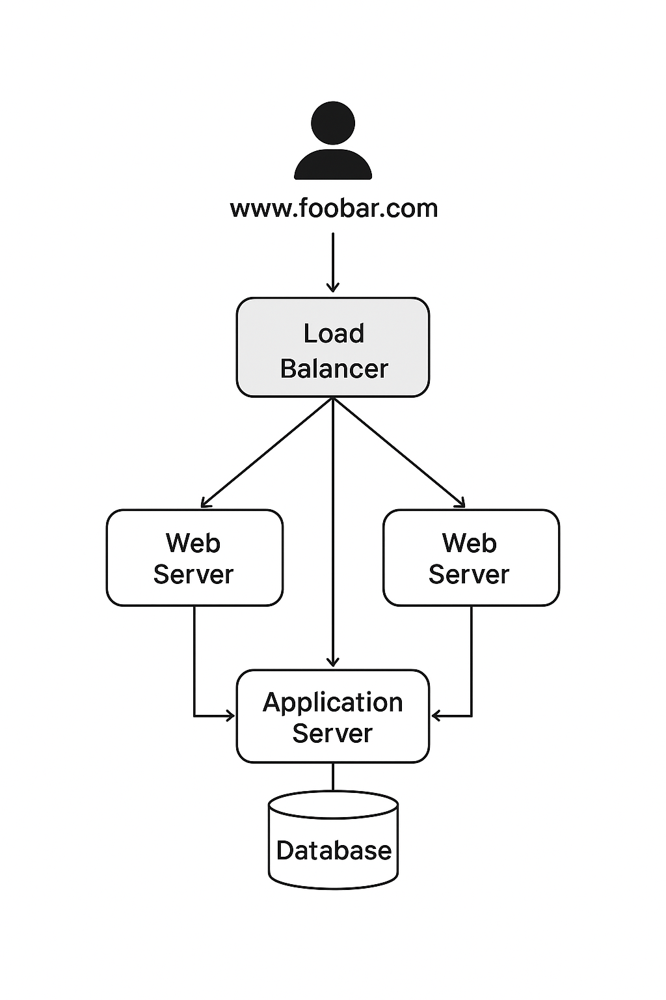

# **3 – Scale Up**

## **Scenario**

To improve performance and scalability, the web infrastructure is **split across multiple servers**. Each component (web server, application server, database) runs on its **own dedicated server**, and the load balancer is configured in a **cluster** with another load balancer for redundancy.

---

## **Infrastructure Design**

**Components:**

1. **Domain Name:** `www.foobar.com`

   * DNS A record pointing to the **load balancer cluster**.

2. **Load Balancer Cluster:** HAproxy

   * Two load balancers configured in **Active-Active cluster**.
   * Role: Distribute incoming traffic across **web servers**, provide redundancy in case one load balancer fails.

3. **Web Servers (2 servers):**

   * Only serve **static content** (HTML, CSS, JS).
   * Role: Offload web traffic from application servers, improve scalability.

4. **Application Servers (2 servers):**

   * Only run **business logic and dynamic content**.
   * Role: Handle computation, data processing, and communicate with the database.

5. **Database Server (1 server):**

   * MySQL Primary-Replica configuration possible.
   * Role: Store and manage application data.

6. **Communication:**

   * Users connect via **HTTPS**.
   * Load balancer → Web server → Application server → Database.

---

## **How It Works**

1. User requests `www.foobar.com`.
2. DNS resolves to the **load balancer cluster IPs**.
3. HAproxy distributes requests to **web servers**.
4. Web server serves static files or forwards dynamic requests to **application servers**.
5. Application servers interact with the **database** to read/write data.
6. Responses follow the same path back to the user.

---

## **Why We Added These Elements**

* **Extra server:** Allows **dedicated resources** per component (web, app, DB).
* **Load balancer cluster:** Removes SPOF at the load balancing layer.
* **Separated components:** Easier to **scale independently**, e.g., adding more web servers if static traffic grows without touching the database.

---

## **Application Server vs Web Server**

| Component              | Role                                                                 |
| ---------------------- | -------------------------------------------------------------------- |
| **Web Server**         | Serves static content (HTML, CSS, JS). Can forward dynamic requests. |
| **Application Server** | Runs backend logic, handles business rules, interacts with database. |

---

### **Diagram (Example)**

